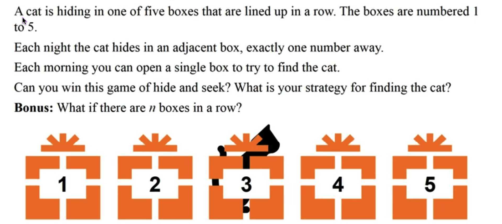
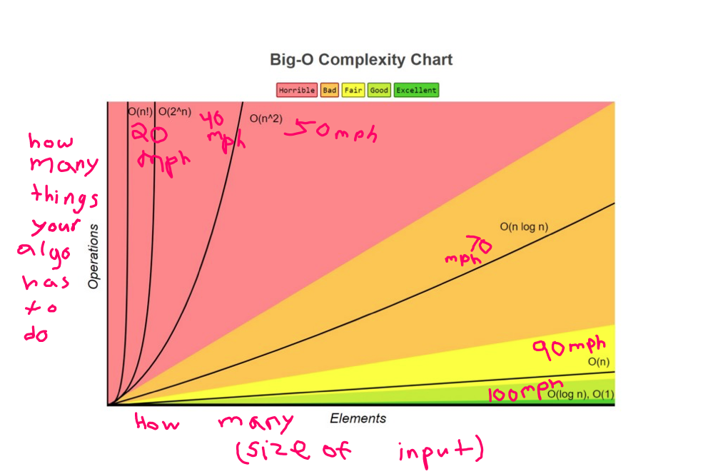

# CatInTheBox
<p align="center">
  
</p>

## Points to consider 🐱
> ✅ The cat will move every day we open a box, if we start from box 1, and check that box n times, the cat will move n times.<br>
> ✅ The cat will always move to 1 adjacent box. <br>


## Proposal :octocat:
> Create an algorithm that iterates n times over the first index. (n being the length of our array.) <br>
> Example: If we have an array of 5 elements/boxes we will check over the first box for 5 days, generating 5 movements on the cat.
> Then, we will continue iterating over the next index but only n - 1 times, the next index we will iterate n - 2, and so on.

# Time complexity:
> ## `n(n+1)/2` = O(n)

## 🧦 **_Insights:_** 
1. Is it really fast?
> We can tell that the algorithm is fast, because as we are genrating movements on the cat each day we check, we are somehow increasing the probability that the cat passes through a box we are checking, here is a quick image of different time complexity algorithms and we can indeed see that O(n) is quite faster than others.
<br>

✅ **"When writing algorithms, time complexity and memory (space) are in balance"** <br>
✅ **"We use asymptotic notation to exclude less important cases, and ust focuses on running time"**

<p align="center">
  
</p>

# ✅ **"We can tel that the maximum amount of days needed for 5 boxes will be 14"** <br>

## 🧦 **_Code_** 
```ruby
def cat_moving_simulation(correct_box, boxes_array)
  return 1 if correct_box == 1
  return -1 if correct_box == boxes_array.last
  random_movement = rand(0..1)
  return random_movement == 0 ? 1 : -1
end
```
> This is a simulator we used to test our code, so that evrey time we check a box, this function will be called and the cat will move, a good thing to specify is that we will always move the cat 1 box to the right if is at box 1, because the cat can't go to any other place. A similar situation happens with the last box, that's why we use this 2 lines.
```ruby
return 1 if correct_box == 1
return -1 if correct_box == boxes_array.last
```
<hr>

```ruby
def searching_minino(boxes_array, correct_box)
  days = 1
  boxes_array.each_with_index do |box, index|
    tries_per_box = boxes_array.length - index
    while tries_per_box != 0
      return [days, box] if box == correct_box
      tries_per_box -= 1
      days += 1
      correct_box += cat_moving_simulation(correct_box, boxes_array)
    end
  end
end
```
> This is our main function, and there are a few things to highlight, the function receives our array, and the initial position of the cat which will suddenly be changed. We also specify a days counter to check how many days we spent to get the final solution. The function will check over each index/box in our array, until it finds that the box checked macthes with the correct position of the cat. <br>
> ✅ **"Each time we change from box, we are iterating over that box -1 times than the previous one"**

# Try this code in your console!
```
git clone git@github.com:daniel-enqz/CatInTheBox.git
cd CatInTheBox
ruby main.rb
```
> ✅ **"Feel free to change this lines, and chenge the length of the array and the initial position of the cat 🐱"**
```ruby
boxes_array = (1..5).to_a
result = searching_minino(boxes_array, 4)
```
